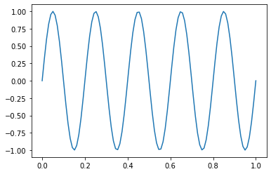
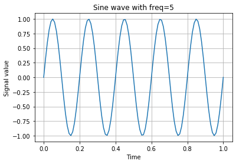

# Computational Intelligence
- Instructor   : [Sepideh Hajipour](http://sharif.edu/~hajipour/)
- Assistant    : [Pooria Ashrafian](https://pooria90.github.io/)

This page accompanies the class material of EE25-729 course at [the Sharif University of Technology](https://en.sharif.edu/). Feel free to write your questions/comments to [my email](pooria.ashrafian@gmail.com).

## A gentle intro to Python

Python was developed in the early 90's by Guido van Rossum at the National Research Institute for Mathematics and Computer Science in the Netherlands. 

Python is designed to be highly readable. It uses English keywords frequently, and it has fewer syntactical constructions than other languages.

- **Python is interpreted**: You don't need to compile your code. It is processed at runtime like MATLAB.
- **Python is interactive**: You can use command prompt and interact with the interpreter, like command line in MATLAB.
- **Python is object-oriented**: You can define custom classes and objects, and use inheritance from parent classes.

You can download a suitable version from [python.org](https://www.python.org). 


### Writing Python

To run Python codes, you may either write your code in a Python script (`.py` format) or a Python notebook (`.ipynb` format).

For writing Python scripts you can either use the default Python editor in Python standard library, **IDLE**, or any other editor for this purpose like **VS Code** or **PyCharm**.

Notebooks provide you with the the capability called **cell**. You can add several cells in a notebook and run each cell separately. You can either install **Jupyter notebook** after installing Python, or use Colab notebooks at [colab.research.google.com](https://colab.research.google.com/). The benefit of using Colab is that you have access to many preinstalled Python packages.


### Installing a Python package

After you successfully installed Python and set up Python path, you can open your command prompt and install additional packages by using `pip`. For example, in order to install Jupyter notebook you can run:

```shell
pip install jupyter-notebook
```


### Python shell

From now on, you can use scripts, notebooks, or even command prompt to run code. At the beginning, I strongly recommend you to write some statements in Python shell for getting used to it. Python shell is an enviornment where you can run single Python statements and see the result in place. Type `python` in your command prompt and press `enter`. The Python shell opens like this:

```shell
C:\Users\Asus>python
Python 3.8.3 (tags/v3.8.3:6f8c832, May 13 2020, 22:20:19) [MSC v.1925 32 bit (Intel)] on win32
Type "help", "copyright", "credits" or "license" for more information.
>>>
```

Try to interact with the interpreter. Two basic functions to try are `print` and `type`. With the former you can show a variable to the user, and by using the latter you can use data type (or *class*) of a variable. An example of playing with the shell can be like the following box. As you may notice, `#` is used to define single-line comments in Python. The interpreter ignores everything after `#`.

```shell
>>> print ('Hello World!') # Strings can be defined by '' or "".
Hello World!
>>> x = 216
>>> print (x)
216
>>> type(x) # x is integer because it is define without a floating point
<class 'int'>
>>> y = 12.56 # y is floating point number
>>> type(y)
<class 'float'>
```

To define a variable, you may use lower or upper case letters, or underscore.

```shell
>>> family_name = 'Ashrafian'
>>> print (family_name)
Ashrafian
>>> type(family_name) # it is a string (str) variable
<class 'str'>
>>> Course = 'Computational Intelligence'
>>> print (Course)
Computational Intelligence
```


### Data types

**Numbers**: You have already seen integer and float numbers. In the following example you get familiar with arithmetic and assignment operators.

```python
x = 12  # = is assignment operator; As you have seen in C or MATLAB

print (type (x))  # prints <class 'int'>

print (x + 2)  # prints 14
print (x - 3)  # prints 9

print (x / 4)  # prints 3.0; / is float division. It means the result is a float
print (type (x/4)) # prints <class 'float'>

print (x // 5)  # prints 2; // is the integer division, or so called 'quotient'
print (x ** 2)  # prints 144; ** is the power operation

# Assignment operators
x += 3
print (x)  # prints 15
x -= 1
print (x)  # prints 14
x *= 3
print (x)  # prints 42
x **= 2
print (x)  # what do you think?
```


**Booleans**: They can be either `True` or `False`. Logical operators (`and`, `or`, `not`) and comparison (`==`, `>`, `>=`, `!=` (not equal), ...) operators work on them.

```python
x = True
print (type (x))  # prints <class 'bool'>
print (not x)  # prints False

y = 15
print (y > 5)  # prints True

p = y > 5
print (type (p)) # prints <class 'bool'>
print (y == 12)  # prints False

print ((y > 3) and (y < 10))  # prints False; because one of them is False
print ((y > 3) or (y != 10))  # prints True; because one of them is Ture
```


**Strings**: We said that they are either defined by single quote (`''`) or double quote (`""`).

```python
s1 = 'computational'
s2 = 'intelligence'

L1 = len (s1)  # len counts the number of characters
print (L1)  # 13 characters; yeah?

print (s1 + s2)	# prints computationalintelligence (+ for str = concatenation)
s_cat = s1 + ' ' + s2
print (s_cat)  # prints computational intelligence
print (f'hello from {s_cat}')  # You see that f and {}? Those are for formatted output; prints hello from computational intelligence
```

Strings have useful methods. Wait...What is a method?

- Method is a function. However, unlike the functions that `print` and `len` that we have already seen, it is defined for its object. So, without defining a string, there is **no string method**. Methods are applied using a `.` after the variable. For example:

```python
s = 'Pooria'
print(s.upper())  # makes everything uppercase: 'POORIA'
print(s.lower())  # makes everything lowercase: 'pooria'

s = 'i am pooria'
print(s.capitalize()) # make first letter capital: 'I am...
print(s.find('p'))  # finds the index of 'p' by starting from zero; prints 5
print(s.split())  # splits s into a list of words: ['i', 'am', 'pooria']
```

For a complete list refer to Python documentations in [here](https://docs.python.org/3/library/stdtypes.html#string-methods).


## Numerical Python: numpy


## Visualizations: Intro to matplotlib

For our visualizations, `matplotlib.pyplot` is all we need. Let's import the module and set up figure and axes.
```python
import matplotlib.pyplot as plt

fig, ax = plt.subplots()
```
`plt.subplots()` is a function that returns a tuple containing a figure and axes object(s). `fig` is useful for saving what we have drawn using `ax`. 
Now I draw a sine wave to show how `ax` works.

```python
import numpy as np

t = np.linspace(0, 1, 100)
f = 5
x = np.sin(2 * np.pi * f * t)

ax.plot(t,x)
plt.show() # To display open figures; fig in here
```

After running we see this:



Let's make it prettier using `ax`'s methods:

```python
ax.plot(t, x)
ax.set_title(f'Sine wave with freq={f}')
ax.set_xlabel('Time')
ax.set_ylabel('Signal value')
ax.grid(True)
plt.show()
```

There we go:




## Let's get to the point: pytorch


## A little bit of genetic algorithms: pyeasyga


<!---
You can use the [editor on GitHub](https://github.com/CI-fall21/CI-fall21.github.io/edit/main/index.md) to maintain and preview the content for your website in Markdown files.

Whenever you commit to this repository, GitHub Pages will run [Jekyll](https://jekyllrb.com/) to rebuild the pages in your site, from the content in your Markdown files.

### Markdown

Markdown is a lightweight and easy-to-use syntax for styling your writing. It includes conventions for

```markdown
Syntax highlighted code block

# Header 1
## Header 2
### Header 3

- Bulleted
- List

1. Numbered
2. List

**Bold** and _Italic_ and `Code` text

[Link](url) and 
```

For more details see [Basic writing and formatting syntax](https://docs.github.com/en/github/writing-on-github/getting-started-with-writing-and-formatting-on-github/basic-writing-and-formatting-syntax).

### Jekyll Themes

Your Pages site will use the layout and styles from the Jekyll theme you have selected in your [repository settings](https://github.com/CI-fall21/CI-fall21.github.io/settings/pages). The name of this theme is saved in the Jekyll `_config.yml` configuration file.

### Support or Contact

Having trouble with Pages? Check out our [documentation](https://docs.github.com/categories/github-pages-basics/) or [contact support](https://support.github.com/contact) and we’ll help you sort it out.
--->
